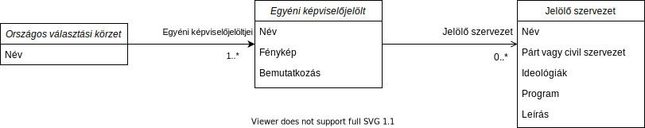
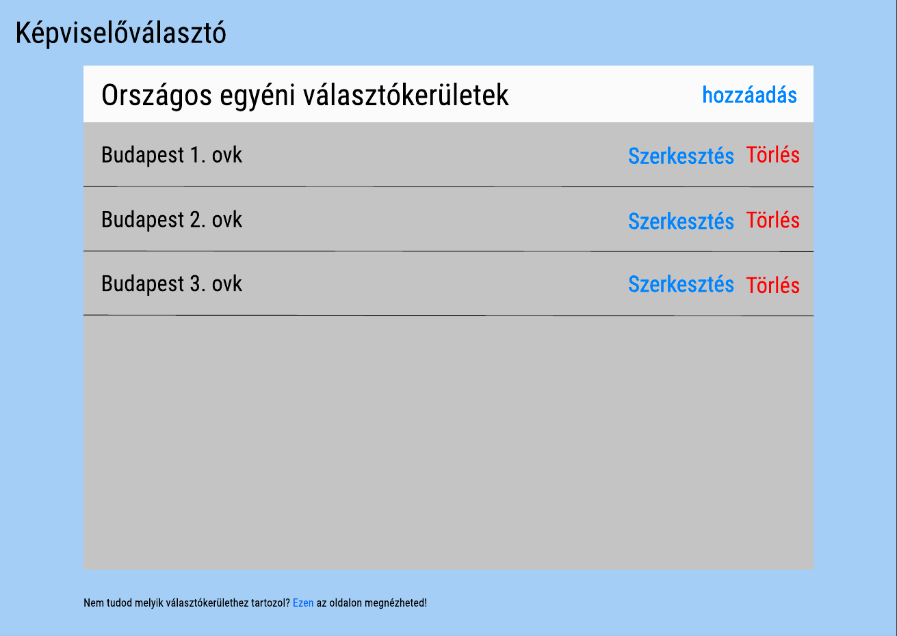
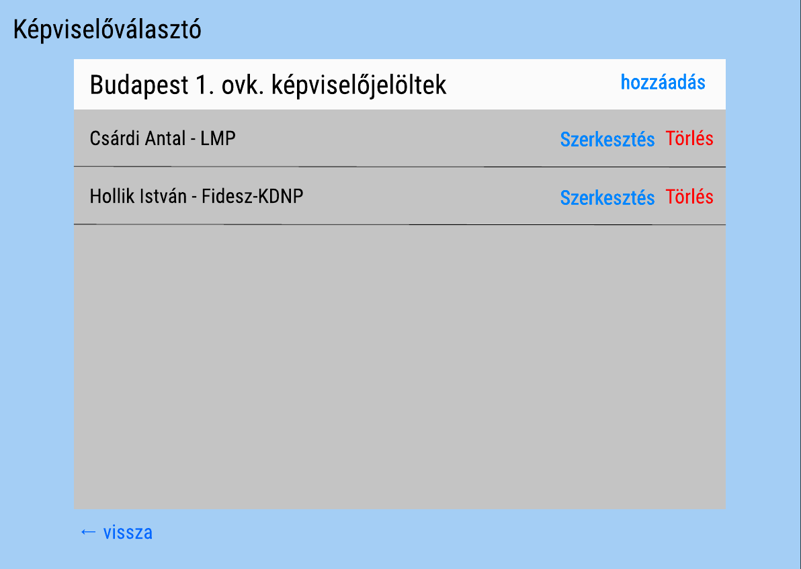
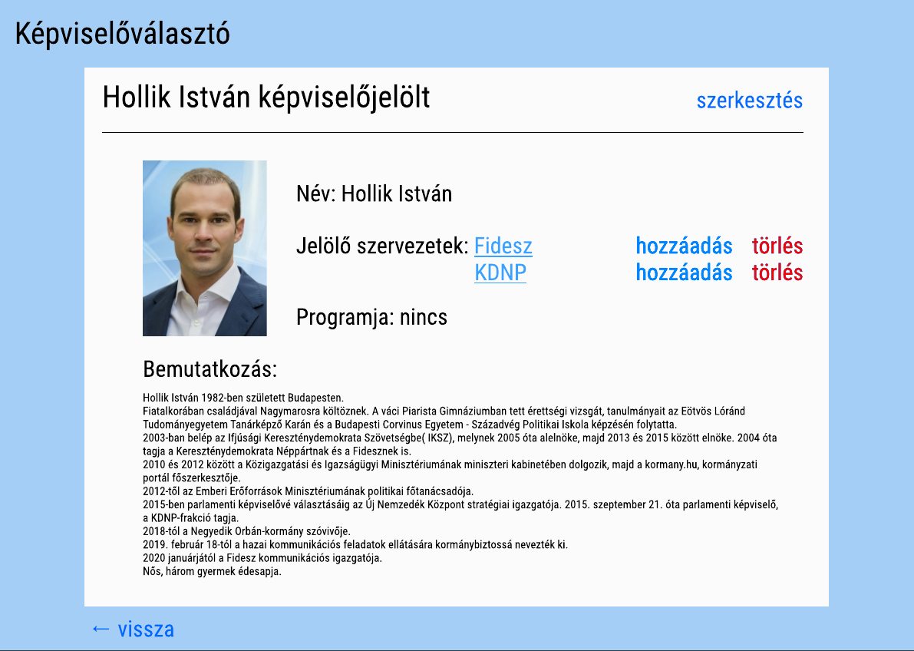
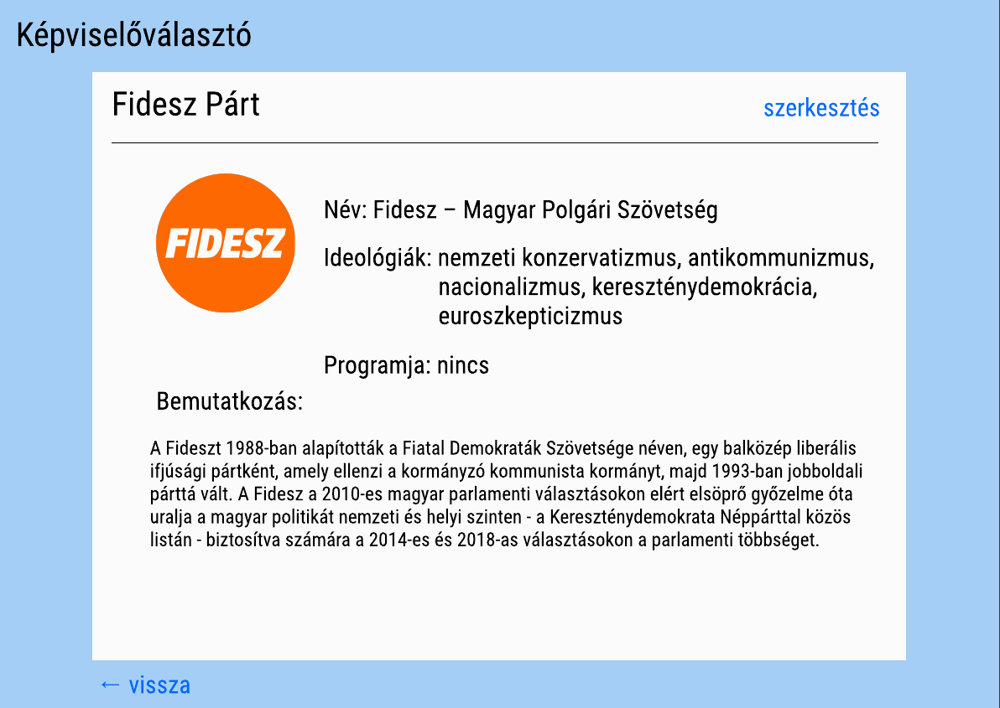

# 1. Feladat - Specifikáció

## Az alkalmazás célja

Az országgyűlési választás a legfontosabb esemény egy demokratikusan működő állam életében. Fontos, hogy a választók megismerjék az őket képviselni kívánó politikusokat, hogy a választáskor a számukra és a közösségük számára a lehető legjobb jelöltet tudják kiválasztani.

A célom a házi feladat elkészítése során, hogy egy olyan alkalmazást készítsek el, amely lehetőséget teremt az egyéni képviselőjelöltek jobb megismeréséhez.

## Entitások

### Országos választási körzet
    
Tartalmazza a körzet nevét és az induló képviselőjelölteket.

### Képviselőjelölt
    
Tartalmazza a jelölt nevét, fényképét, jelölő szervezetét vagy szervezetetit, a programjának linkjét valamint egy rövid bemutatkozást.

### Jelölő szervezet

A jelölő szervezet tartalmazza a szervezet nevét, hogy párt-e vagy civil szervezet, a szervezetet jellemző ideológiákat, programjának linkjét és egy rövid leírást róluk

### Az entitások kapcsolata

## Nézetek

A nézetek figmában generáltam, [itt](https://www.figma.com/file/UaVRTvcdgIYM5fBZY6yzoq/Untitled?node-id=0%3A1) lehet őket megtekinteni.

### Választási körzetek listája

Ebben a nézetben fel vannak sorolva a választási körzetek. A lista egyik elemére kattintva lehet eljutni a körzeten belüli képviselőjelöltek listájának nézetéhez.

### Képviselőjelöltek listája

Ebben a nézetben vannak felsorolva azok a képviselőjelöltek, akikre az előző nézetben rákattintott a felhasználó. A lista egyik elemére kattintva lehet eljutni a képviselőjelölt adataihoz, és az oldal alján található "vissza" gombbal pedig az előző nézethez.

### Képviselőjelöltek adatai

Ebben a nézetben találhatóak a képviselőjelöltek adatai. Itt a párt vagy civil szervezet nevére kattintva lehet eljutni a jelölő szervezet nézetéhez. A vissza gombbal lehet eljutni a képviselőjelöltek listájának nézetéhez.

### Jelölő szervezet adatai

Ebben a nézetben találhatóak meg a jelölő szervezet adatai. A vissza gombra kattintva lehet visszajutni az egyéni képviselőjelölt adataihoz.

